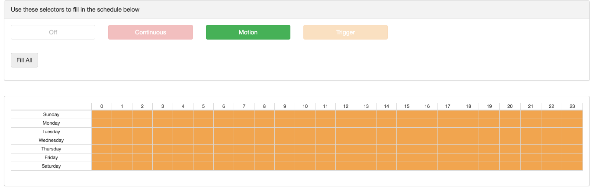
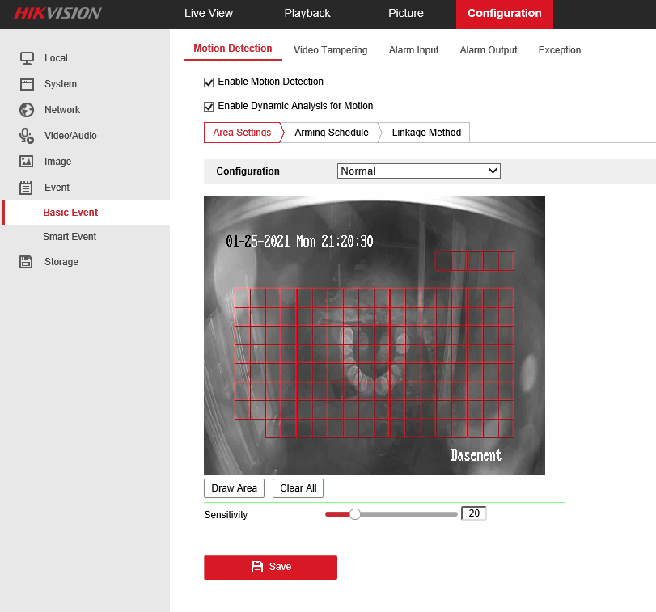

ONVIF motion event triggering
=============================

What is ONVIF?
-------------------

ONVIF is a universal way for software developers / manufactures to connect to modern IP cameras and recorders.

We currently support ONVIF camera detection (scanning for IP cameras on the same physical network) and ONVIF motion event triggering.

Motion event triggering, also known as 'camera side motion detection' greatly reduces the CPU usage on your Bluecherry server.  However, it requires configuration on each IP camera and in the Bluecherry settings.

Setup event triggering
----------------------

Browse to the camera you wish to enable for ONVIF detection and select 'Schedule'.

Select 'Use device-specific schedule for this camera.' and 'Trigger recording on ONVIF events'.

Then select 'Trigger' in the scheduling checkbox and click 'Fill all', or whatever schedule you wish to enable for your system.

Then click 'Save changes'

Check the Bluecherry log (System Log) or from the command line 'tail -f /var/log/bluecherry.log'

On camera Setup
---------------

Connect to the IP camera's web interface, or click IP Camera -> Settings -> On Camera Configuration'

Each camera will be different.  You will want to search for 'Events' or 'Motion'.  Most cameras will have the option to draw an area on the screen where you want to enable motion detection notifications.  Below is an example from an Hikvision:

Verifying Configuration
-----------------------

If the camera supports ONVIF detection and you followed the steps correctly you will see something similar to these lines::

`
Jan 25 20:34:54 x5 bc-server[18037]: I(8/Back deck): Switching to new recording schedule 'triggered'
Jan 25 20:34:54 x5 bc-server[18037]: I(8/Back deck): Starting onvif events thread 2119984896 for device 8 ...
Jan 25 20:34:54 x5 bc-server[18037]: I(8/Back deck): Subscribed to ONVIF events at http://192.168.86.200/onvif/Events/PullSubManager_2021-01-26T02:34:54Z_0
`

When a motion event occurs the log should show:

`
Jan 25 20:35:15 x5 bc-server[18037]: I(8/Back deck): Marking the passed packet with TriggerFlag
`
